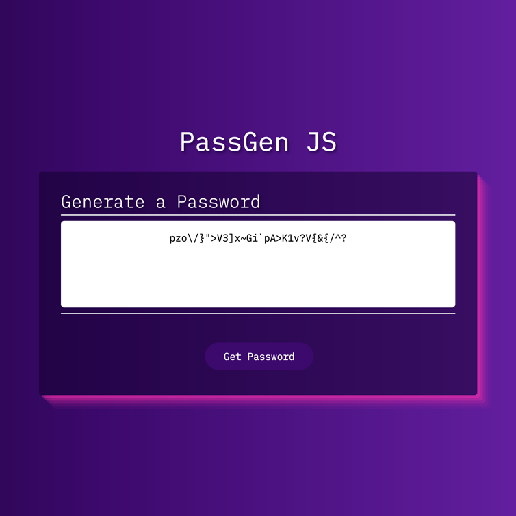
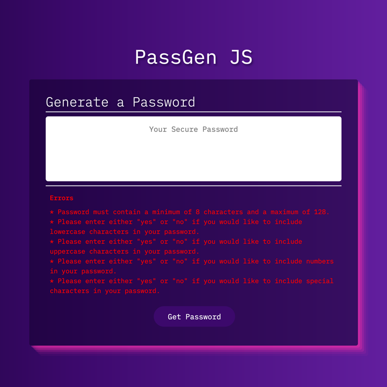
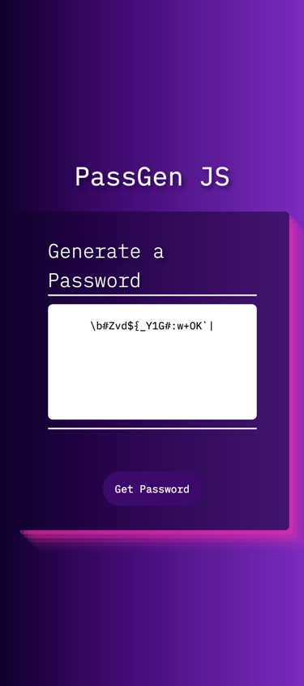

# PassGen JS

## Tables of Content
- [The Assignment Brief](#the-assignment-brief)
- [Links](#links)
- [Screenshots](#screenshots)
- [My Process](#my-process)
- [Contributors](#contributors)
- [Acknowledgements](#acknowledgements)

---

## The Assignment Brief

Create and deploy a password generator application so users can obtain a random password. Users should choose criteria to include in their password, such as character types and length.

## Links

[PassGen JS Github Repository](https://github.com/matthew-millard/pass-gen-js)

[PassGen JS Github Pages](https://matthew-millard.github.io/pass-gen-js/)

## Screenshots

## My Process

1. I refactored the existing starter code so it was fully responsive to different viewport sizes.
2. Applied my own styling to make the app stand out.
3. I wrote pseudo code so I had a road map to programming the app in JavaScript.
4. Once I was satisfied with my script, I spent a great deal of time testing for bugs.
5. Deployed the app on Github pages.

## Contributors

Starter HTML and CSS code provided by:
[Xander Rapstine](https://github.com/Xandromus)

## Acknowledgements

[Andy Bell - Modern CSS Reset](https://andy-bell.co.uk/a-modern-css-reset/)